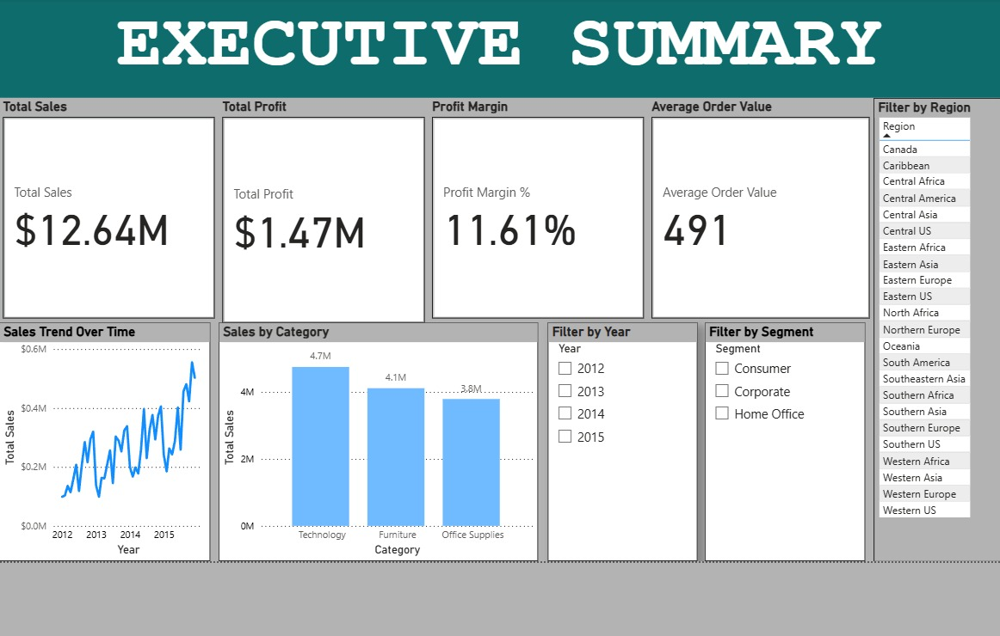
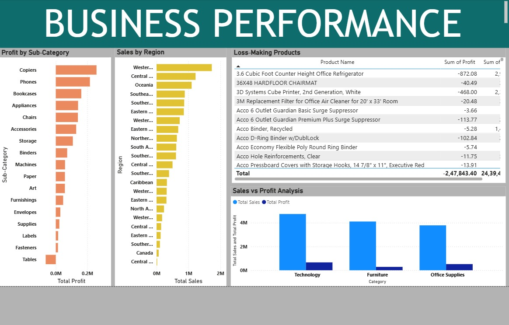

# Consultant-Level Business Insights Dashboard (Power BI)

## Project Overview
This project presents a consultant-style Business Intelligence dashboard developed using Microsoft Power BI.  
It provides executive-level and performance-level insights using the Global Superstore 2016 dataset.

## Objectives
- Analyze overall business performance
- Track key KPIs such as Sales, Profit, and Profit Margin
- Identify loss-making products and high-performing regions
- Support data-driven business decision-making

## Dataset
- Global Superstore 2016 (Kaggle)

## Dashboard Pages
### 1. Executive Summary
- Total Sales
- Total Profit
- Profit Margin
- Average Order Value
- Trend and category overview

### 2. Business Performance Insights
- Profit by sub-category
- Sales by region
- Loss-making products
- Sales vs Profit comparison

## Tools & Technologies
- Microsoft Power BI
- DAX
- Excel / CSV

## Dashboard Preview

## Author
Arshath Abdulla A
